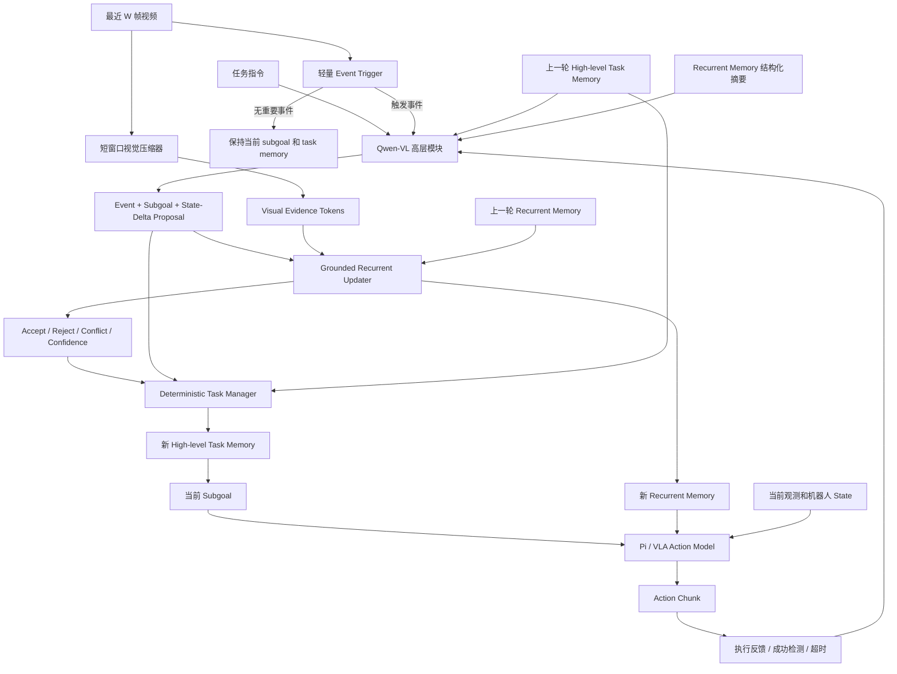

# Qwen-VL 高层任务记忆与递归压缩 MEM 设计

> 日期：2026-08-24  
> 状态：方案设计稿  
> 目标：构建一个不依赖任务专用 relation classifier、支持任意长度视频历史、可接入 VLA action policy 的分层记忆系统。

## 1. 核心结论

本方案采用两个时间尺度不同、职责不同的记忆系统：

1. **High-level task memory**：由 Qwen-VL 和确定性的 Task Manager 共同维护，记录任务分解、subgoal 状态、失败和恢复历史。
2. **Recurrent compressed memory**：由短视频窗口和事件条件递归更新，保存对 action 有用的视觉、实体、空间和状态 belief。

Qwen-VL 不直接控制机器人，也不直接覆盖完整 memory。它只负责：

- 理解最近视频中的高层事件；
- 判断当前 subgoal 是否完成、失败或不确定；
- 生成下一 subgoal；
- 提出结构化的候选 state delta。

Recurrent updater 负责：

- 使用当前视觉证据验证 Qwen-VL 的候选事件；
- 接受、拒绝或部分接受 state delta；
- 将任意长度历史递归压缩为固定数量的 memory tokens；
- 为低层 action model 提供持续、固定容量的历史条件。

核心更新形式为：

\[
Z_t=C(X_{t-W+1:t})
\]

\[
(\hat E_t,G_t,c_t)=Q(I,H_{t-1},R(M_{t-1}),X_{t-W+1:t},F_t)
\]

\[
(M_t,U_t)=U_\theta(M_{t-1},Z_t,\hat E_t,G_t,c_t)
\]

\[
H_t=T(H_{t-1},U_t,G_t,F_t)
\]

\[
a_t\sim\pi_\phi(O_t,M_t,G_t)
\]

其中：

- \(I\)：原始任务指令；
- \(H_t\)：结构化高层任务记忆；
- \(M_t\)：固定大小的连续 recurrent memory；
- \(X_{t-W+1:t}\)：最近 \(W\) 帧短视频窗口；
- \(Z_t\)：短窗口视觉 tokens；
- \(F_t\)：执行器和环境反馈；
- \(\hat E_t\)：Qwen-VL 提出的候选事件；
- \(G_t\)：当前或下一 subgoal；
- \(U_t\)：经过视觉验证的 memory update 结果；
- \(a_t\)：低层连续动作。

## 2. 设计动机

### 2.1 原生完整视频 MEM 的限制

一次性处理完整历史的 MEM 具有以下问题：

- 历史越长，视频编码计算和激活显存越大；
- 推理时必须重复处理大量已经看过的帧；
- 很难自然支持无限长或长度不固定的真实任务；
- 稀疏最终监督无法给复杂中间状态变化提供清晰 credit assignment。

当前 ShellGame 控制实验已经表明：

| 结构 | 监督 | Episode-heldout 最终杯位 |
|---|---|---:|
| Native Pi0Mem，完整 60 帧 | final-only | 约 33% |
| Native Pi0Mem，完整 60 帧 | relation + stage-slot + final | 99.17% |
| 短窗口 recurrent memory | 事件/状态监督 | 接近 100% |

因此，不能简单声称原生 MEM 在结构上无法完成任务。更严谨的结论是：

- 原生 MEM 在充分时间监督下可以学会；
- final-only 监督不足以稳定诱导多阶段状态跟踪；
- 递归压缩 MEM 的核心价值应放在流式处理、固定容量、长历史扩展和通用写入机制上。

### 2.2 任务专用辅助监督的限制

此前 recurrent updater 依赖任务专用标签，例如：

```text
initial cup classifier
swap relation classifier
stage-slot classifier
```

这种方案在 ShellGame 中有效，但迁移到新任务时需要重新定义：

- 事件类别；
- relation 类别；
- 状态分类器；
- 阶段划分；
- 辅助 loss。

新方案使用 Qwen-VL 产生开放词汇但结构固定的 event/state-delta，使公共 recurrent updater 不再包含杯子、交换或固定三阶段假设。

## 3. 目标与非目标

### 3.1 目标

- 每次只处理最近短视频窗口，不重复编码完整历史；
- 将历史压缩到固定数量 memory tokens；
- 在没有固定阶段边界的情况下在线更新；
- 使用通用 event/state-delta 接口替代任务专用 relation head；
- 支持 subgoal 完成、失败、重试和重新规划；
- 让 action model 读取连续 memory tokens，而不是只读取自然语言摘要；
- 支持 Qwen-VL 幻觉检测、事件去重和不确定性传播；
- 同一个 updater 能跨不同任务复用。

### 3.2 非目标

- 不让 Qwen-VL 输出高频连续动作；
- 不让 Qwen-VL 每帧运行；
- 不使用自然语言替代精确几何和当前视觉；
- 不要求 recurrent memory 单独建模高频动力学、接触力或控制误差；
- 第一版不进行 Qwen-VL、memory 和 action policy 的全链路端到端反向传播。

## 4. 总体系统结构



## 5. 三种运行状态

系统运行时保存三种不同状态。

### 5.1 高层任务记忆 `TaskMemory`

`TaskMemory` 是可检查、可序列化、低频更新的结构化状态。

推荐最小 schema：

```json
{
  "task_id": "episode-000123",
  "task_instruction": "Put the red block into the blue bowl.",
  "revision": 7,
  "active_subgoal_id": "grasp_red_block",
  "subgoals": [
    {
      "id": "locate_red_block",
      "instruction": "Locate the red block.",
      "status": "completed",
      "success_condition": "red block is localized",
      "failure_condition": "red block cannot be found",
      "started_at": 1.2,
      "finished_at": 3.8,
      "confidence": 0.98,
      "evidence_event_ids": ["event-0004"]
    },
    {
      "id": "grasp_red_block",
      "instruction": "Grasp the red block.",
      "status": "active",
      "success_condition": "red block moves rigidly with the gripper",
      "failure_condition": "gripper closes without lifting the block",
      "started_at": 3.8,
      "finished_at": null,
      "confidence": 0.74,
      "evidence_event_ids": []
    }
  ],
  "failures": [],
  "pending_reobservation": false,
  "last_committed_event_id": "event-0004"
}
```

`status` 使用固定集合：

```text
pending
active
completed
failed
uncertain
cancelled
```

Qwen-VL 不直接覆盖完整 `TaskMemory`，只输出 patch；Task Manager 负责检查和提交 patch。

### 5.2 连续递归记忆 `RecurrentMemory`

`RecurrentMemory` 是 action model 使用的连续状态：

\[
M_t\in\mathbb{R}^{B\times M\times D}
\]

第一版推荐：

```text
M = 128 memory tokens
D = 1152 hidden width
```

它保存：

- 实体外观和身份连续性；
- 隐藏或被遮挡物体的 belief；
- 空间和几何状态；
- 物体间关系；
- 与当前 subgoal 相关的任务状态；
- 不确定性和冲突信息。

不要求每个 token 都具有硬编码语义。可以增加少量通用查询槽，例如：

```text
global task state queries
entity queries
spatial relation queries
uncertainty queries
subgoal progress queries
```

但公共模型中不能出现 `left_cup`、`swap_0` 等任务专用含义。

### 5.3 最近视频 Ring Buffer

在线推理只保存最近 \(W\) 帧：

```text
recent_frames: [B, W, H, W, C]
frame_timestamps: [B, W]
frame_valid_mask: [B, W]
```

推荐初始设置：

```text
window_size = 6
window_stride = 2
overlap = 4 frames
```

窗口必须重叠，避免事件恰好跨越两个不重叠窗口而被拆断。

## 6. 模块定义

### 6.1 轻量 Event Trigger

Event Trigger 每个滑动窗口运行，输出：

```python
EventTriggerOutput(
    event_probability: Float[B],
    event_embedding: Float[B, Ke, D],
    event_active: Bool[B],
    rising_edge: Bool[B],
    uncertainty: Float[B],
)
```

触发条件推荐使用迟滞：

```text
event_probability >= high_threshold  → event_active=True
event_probability <= low_threshold   → event_active=False
rising_edge = False → True 的首次变化
```

只有 `rising_edge` 或显式失败/完成反馈才调用 Qwen-VL，防止同一个事件重复写入。

第一版建议：

```text
high_threshold = 0.70
low_threshold = 0.35
cooldown_windows = 1~2
```

Event Trigger 不需要在公共模型中预测任务专用 event class，只需要判断：

- 是否发生了足以改变任务状态的重要事件；
- 当前窗口是否包含完整、可解释的事件；
- 是否应当调用高层模块。

### 6.2 Qwen-VL 高层模块

Qwen-VL 是低频、无内部持久状态的高层事件解释器和 subgoal planner。

每次调用必须显式传入：

```python
QwenPlannerInput(
    task_instruction: str,
    recent_event_video: VideoFrames,
    previous_task_memory: TaskMemory,
    recurrent_memory_summary: WorldStateSummary,
    executor_feedback: ExecutorFeedback,
    available_skills: list[SkillSpec],
    timestamp: float,
)
```

建议视频输入为：

- 最近事件窗口原始帧；或
- 事件前、事件中、事件后的 8~16 个关键帧；
- 每帧带相对时间标识；
- 不输入从任务开始到当前的完整视频。

Qwen-VL 输出固定 schema：

```json
{
  "request_id": "qwen-0018",
  "event": {
    "event_id": "event-0018",
    "type": "successful_grasp",
    "entities": ["red_block", "gripper"],
    "state_delta": {
      "operation": "set_relation",
      "subject": "red_block",
      "predicate": "attached_to",
      "object": "gripper"
    },
    "confidence": 0.93,
    "evidence": [
      "gripper closed",
      "block moved upward with gripper"
    ]
  },
  "subgoal_updates": [
    {
      "subgoal_id": "grasp_red_block",
      "old_status": "active",
      "proposed_status": "completed",
      "confidence": 0.93,
      "required_evidence": "object lift detected"
    }
  ],
  "next_subgoal": {
    "id": "move_above_blue_bowl",
    "instruction": "Move the grasped red block above the blue bowl.",
    "success_condition": "red block is above the blue bowl",
    "failure_condition": "red block detaches from the gripper",
    "focus_entities": ["red_block", "blue_bowl"]
  },
  "decision": "propose_update",
  "request_reobservation": false
}
```

`decision` 使用固定集合：

```text
propose_update
keep_state
request_reobservation
report_failure
finish_task
```

### 6.3 World State Readout

Qwen-VL 不需要读取全部连续 memory tokens。公共 readout 将 `RecurrentMemory` 转换为紧凑摘要：

```python
WorldStateSummary(
    entities: list[EntityState],
    relations: list[RelationState],
    active_uncertainties: list[UncertainState],
    task_progress_embedding: list[float] | None,
    global_confidence: float,
)
```

示例：

```json
{
  "entities": [
    {
      "id": "red_block",
      "visible": false,
      "position": [0.42, -0.13, 0.08],
      "position_confidence": 0.71
    }
  ],
  "relations": [
    {
      "subject": "red_block",
      "predicate": "attached_to",
      "object": "gripper",
      "confidence": 0.64
    }
  ],
  "global_confidence": 0.69
}
```

第一版可以用一个受限 JSON readout；后续可以把 memory tokens 经过 projector 作为 soft tokens 直接输入本地 Qwen-VL。

### 6.4 Grounded Recurrent Updater

Updater 输入：

```python
RecurrentUpdaterInput(
    previous_memory: Float[B, M, D],
    visual_tokens: Float[B, Kv, D],
    event_tokens: Float[B, Ke, D],
    subgoal_tokens: Float[B, Kg, D],
    event_confidence: Float[B],
    event_mask: Bool[B],
    delta_operation_embedding: Float[B, D],
)
```

Updater 输出：

```python
RecurrentUpdaterOutput(
    new_memory: Float[B, M, D],
    update_gate: Float[B, M],
    accepted_probability: Float[B],
    conflict_score: Float[B],
    grounded_confidence: Float[B],
    accepted_state_delta: StateDelta | None,
    request_reobservation: Bool[B],
)
```

推荐实现：

\[
C_t=\mathrm{CrossAttn}(M_{t-1},[Z_t;E_t;G_t])
\]

\[
\alpha_t=\sigma(f_\alpha(M_{t-1},C_t,c_t))
\]

\[
\tilde M_t=\mathrm{MLP}(C_t)
\]

\[
M_t=\mathrm{LN}(M_{t-1}+\alpha_t\odot\tilde M_t)
\]

`event_mask=False` 时，`update_gate` 应接近零，避免 memory 在长时间无事件时持续漂移。

Qwen-VL 置信度不能直接作为最终置信度。Updater 必须结合视觉证据重新估计 `grounded_confidence`。

### 6.5 Deterministic Task Manager

Task Manager 是非生成式状态机，职责为：

- 校验 Qwen patch 的 schema；
- 检查 `old_status` 是否与当前状态一致；
- 检查事件是否已经提交；
- 检查 updater 是否接受 state delta；
- 更新 `revision`；
- 原子地提交 subgoal 状态变化；
- 保留失败记录和证据引用；
- 拒绝非法状态跳转。

合法状态转移示例：

```text
pending → active
active → completed
active → failed
active → uncertain
uncertain → active
uncertain → failed
failed → active  # 显式重试
```

不允许：

```text
pending → completed  # 除非存在明确外部证据
completed → active   # 除非创建新的 retry subgoal
```

### 6.6 Action Model

Action model 输入：

```python
ActionPolicyInput(
    current_observation,
    robot_state,
    recurrent_memory: Float[B, M, D],
    active_subgoal_tokens: Float[B, Kg, D],
)
```

Action model 输出固定 horizon action chunk：

```python
ActionPolicyOutput(
    actions: Float[B, H, A],
    policy_confidence: Float[B] | None,
    predicted_subgoal_progress: Float[B] | None,
)
```

Qwen-VL 不直接生成 EEF/joint action。

## 7. 在线推理状态机

```python
def control_step(frame, robot_state, executor_feedback, state):
    state.ring_buffer.append(frame)

    trigger = event_trigger(
        state.ring_buffer,
        previous_event_active=state.event_active,
    )
    state.event_active = trigger.event_active

    should_call_qwen = (
        trigger.rising_edge
        or executor_feedback.subgoal_finished
        or executor_feedback.subgoal_failed
        or executor_feedback.timeout
        or state.task_memory.pending_reobservation
    )

    if should_call_qwen:
        world_summary = memory_readout(state.recurrent_memory)
        proposal = qwen_planner(
            task_instruction=state.task_instruction,
            recent_event_video=state.ring_buffer.keyframes(),
            previous_task_memory=state.task_memory,
            recurrent_memory_summary=world_summary,
            executor_feedback=executor_feedback,
            available_skills=state.skill_registry,
        )

        visual_tokens = visual_compressor(state.ring_buffer)
        update = recurrent_updater(
            previous_memory=state.recurrent_memory,
            visual_tokens=visual_tokens,
            event_tokens=encode_event(proposal.event),
            subgoal_tokens=encode_subgoal(proposal.next_subgoal),
            event_confidence=proposal.event.confidence,
            event_mask=True,
            delta_operation_embedding=encode_delta(proposal.event.state_delta),
        )

        state.recurrent_memory = update.new_memory
        state.task_memory = task_manager.apply_if_grounded(
            previous=state.task_memory,
            qwen_proposal=proposal,
            updater_result=update,
            executor_feedback=executor_feedback,
        )

    actions = action_policy(
        current_observation=frame,
        robot_state=robot_state,
        recurrent_memory=state.recurrent_memory,
        active_subgoal_tokens=encode_subgoal(state.task_memory.active_subgoal),
    )
    return actions, state
```

## 8. 因果性、去重与错误恢复

### 8.1 因果性

- Qwen-VL 只能看到当前时间及以前的帧；
- 训练时事件窗口不能包含事件结果之后过长的未来信息；
- episode-heldout 必须按 episode 划分；
- 不能用完整未来 metadata 直接构造推理输入。

### 8.2 事件幂等性

每个候选事件必须具有：

```text
event_id
time_range
entities
operation
source_request_id
```

Task Manager 维护已提交 `event_id`，同一事件重复出现时不重复写入。

### 8.3 Qwen-VL 幻觉处理

出现下列情况时拒绝或降权：

- Qwen 提到的实体在当前任务和 memory 中都不存在；
- state delta 与视觉证据冲突；
- Qwen 置信度高但 updater grounded confidence 低；
- proposed subgoal 不在可用技能集合；
- proposed completion 缺少 success condition 对应证据。

### 8.4 多假设 memory

当事件不确定时，不要强制单一状态：

```text
hypothesis 1: object attached_to gripper, p=0.62
hypothesis 2: object remains_on table, p=0.38
```

后续观察更新假设概率。第一版可以用多个 hypothesis tokens；简化版本可以只保存均值和 uncertainty token。

### 8.5 安全等待

Qwen 调用尚未返回且当前 subgoal 已结束时，策略应：

- 保持安全姿态；
- 不提前执行未确认的下一 subgoal；
- 允许低风险的视觉重观察动作；
- 设置 planner timeout 和 fallback。

## 9. 训练数据契约

每个 episode 至少包含：

```text
task instruction
timestamped video frames
robot state
action trajectory
executor/outcome feedback
episode success
optional human annotations
```

离线 Qwen 标注推荐保存为 JSONL：

```json
{
  "episode_index": 123,
  "window_start": 48,
  "window_end": 55,
  "event_id": "ep123-event4",
  "event_type": "successful_grasp",
  "entities": ["red_block", "gripper"],
  "state_delta": {
    "operation": "set_relation",
    "subject": "red_block",
    "predicate": "attached_to",
    "object": "gripper"
  },
  "subgoal_before": "grasp_red_block",
  "subgoal_status_after": "completed",
  "next_subgoal": "move_above_blue_bowl",
  "qwen_confidence": 0.93,
  "human_verified": false
}
```

同时采样无事件负样本：

```json
{
  "episode_index": 123,
  "window_start": 30,
  "window_end": 37,
  "event_type": "no_state_change",
  "state_delta": null
}
```

训练/验证必须按 episode 划分，不能按窗口随机划分。

## 10. 分阶段训练 Recipe

### Stage Q0：冻结 Qwen-VL 的离线 schema 验证

目标：先确认 Qwen 能输出稳定、可解析的 event/subgoal schema。

步骤：

1. 从训练轨迹抽取候选事件窗口和无事件窗口；
2. 冻结 Qwen-VL，仅使用统一 system prompt；
3. 输出结构化 JSON；
4. 自动校验 schema、实体引用和状态转移；
5. 人工审核少量样本；
6. 统计事件准确率、漏检、重复、subgoal 完成判断和置信校准。

此阶段不训练 action model。

### Stage Q1：高层 planner 微调或蒸馏（可选）

如果 prompt-only 不稳定：

- 使用审核后的 trajectory-to-patch 数据微调 Qwen-VL；或
- 蒸馏到较小的高层 event/subgoal model；
- 保持输出 schema 不变。

主要目标：

```text
valid JSON rate
event semantic accuracy
subgoal transition accuracy
calibrated confidence
latency
```

### Stage M0：Updater 机械能力验证

先不使用真实视觉，使用合成 event embedding 验证：

- no-event 时 memory 不漂移；
- 相同 event 重复输入不重复更新；
- 多次事件可以组合；
- 错误事件可以被 reject；
- memory 容量固定；
- 任意事件数量可以持续递归。

### Stage M1：通用 recurrent memory 预训练

Updater 不使用任务专用 relation classifier。推荐目标：

\[
L_{mem}=
\lambda_{keep}L_{keep}
+\lambda_{delta}L_{delta}
+\lambda_{future}L_{future}
+\lambda_{cycle}L_{cycle}
+\lambda_{reject}L_{reject}
\]

各项含义：

- `L_keep`：无事件窗口前后 memory 一致，防止漂移；
- `L_delta`：memory update 与 Qwen state-delta embedding 对齐；
- `L_future`：更新后的 memory 预测后续视觉/状态 embedding；
- `L_cycle`：短窗口递归结果与完整事件序列的最终状态摘要一致；
- `L_reject`：打乱实体、时间或 episode 的伪事件必须被拒绝。

建议初始权重：

```text
lambda_keep   = 1.0
lambda_delta  = 1.0
lambda_future = 0.5
lambda_cycle  = 1.0
lambda_reject = 0.5
```

这些 loss 作用于通用 embedding、时序一致性和事件接纳，不要求公共 updater 预测任务专用 relation 类别。

### Stage M2：任务状态 probe

冻结或低学习率训练 memory，使用任务 probe 验证 memory 是否包含目标信息。

Probe 可以任务专用，但只能用于诊断，不进入最终公共模型：

```text
final hidden-object identity
object attachment state
drawer open/closed state
visited landmark
completed step count
```

### Stage A0：Action model 读取 GT/Oracle memory

先验证 action 链路：

- 输入 oracle high-level state；
- 输入 oracle event 更新后的 recurrent memory；
- 训练/评估 action model；
- 确认若 memory 正确，policy 可以完成任务。

### Stage A1：Action model 读取预测 memory

切换到真实预测链路：

```text
Qwen proposal
→ recurrent updater
→ predicted memory
→ action model
```

训练时可以使用 scheduled mixing：

```text
早期：80% oracle / 20% predicted
中期：50% oracle / 50% predicted
后期：10% oracle / 90% predicted
最终：100% predicted
```

避免 action model 只适应完美 memory。

### Stage A2：有限联合微调

第一版只联合微调：

- recurrent updater；
- memory read adapter；
- action expert；
- subgoal adapter。

冻结 Qwen-VL。不要让 action loss 直接反向传播并改变高层语言语义。

## 11. ShellGame 中的运行示例

### 11.1 Reveal

Qwen proposal：

```json
{
  "event": {
    "type": "object_hidden_by_container",
    "entities": ["ball", "middle_cup"],
    "state_delta": {
      "operation": "set_relation",
      "subject": "ball",
      "predicate": "contained_by",
      "object": "middle_cup"
    },
    "confidence": 0.98
  },
  "next_subgoal": {
    "id": "track_hidden_object",
    "instruction": "Track container identities through subsequent motion."
  }
}
```

### 11.2 Swap

Qwen proposal：

```json
{
  "event": {
    "type": "container_exchange",
    "entities": ["middle_cup", "right_cup"],
    "state_delta": {
      "operation": "exchange_entity_states",
      "subjects": ["middle_cup", "right_cup"]
    },
    "confidence": 0.95
  }
}
```

Qwen 不直接输出球最终位于哪个杯子。Updater 根据旧 memory、交换事件和视觉 evidence 更新持久 belief。

### 11.3 交换结束

Qwen proposal：

```json
{
  "event": {
    "type": "observation_phase_finished",
    "confidence": 0.97
  },
  "subgoal_updates": [
    {
      "subgoal_id": "track_hidden_object",
      "old_status": "active",
      "proposed_status": "completed",
      "confidence": 0.97
    }
  ],
  "next_subgoal": {
    "id": "grasp_target_container",
    "instruction": "Grasp and lift the container associated with the hidden ball."
  }
}
```

Action model 从 recurrent memory 中读取目标实体，不要求 Qwen 再次查看完整 60 帧。

## 12. 计算与延迟设计

### 12.1 推荐初始配置

```text
recent window W                = 6 frames
window stride                  = 2 frames
spatial compact tokens/frame   = 64
recurrent memory tokens M      = 128
memory width D                 = 1152
Qwen keyframes/call            = 8~16
action horizon                 = 16
```

### 12.2 Qwen 调用时机

只在以下情况调用：

- 任务开始；
- event trigger rising edge；
- subgoal success/failure；
- timeout；
- memory conflict；
- uncertainty 超过阈值；
- 主动 reobservation。

### 12.3 异步执行

Qwen 调用可以异步运行，但必须满足：

- planner 返回前不执行新的高风险 subgoal；
- action policy 可以继续当前安全动作或保持；
- 每个 response 带 `request_id` 和基于的 `memory_revision`；
- response 到达时如果 revision 已过期，则丢弃并重新请求。

## 13. 公平实验设计

### 13.1 核心结构对照

所有实验使用相同数据、初始化、训练步数、split 和监督：

| 实验 | 历史结构 | 监督 |
|---|---|---|
| A | Native MEM，完整 60 帧 | final-only |
| B | Recursive MEM，10×6 帧 | final-only |
| C | Native MEM，完整 60 帧 | 相同 event/stage 监督 |
| D | Recursive MEM，10×6 帧 | 相同 event/stage 监督 |
| E | Recursive MEM，10×6 帧 | Qwen event/state-delta |

解释：

- `A vs B`：递归结构是否提供更强的状态更新归纳偏置；
- `C vs D`：相同监督下递归压缩是否保持精度；
- `D vs E`：Qwen 是否可以替代人工事件标签；
- `A/C vs B/D/E`：计算、显存和历史长度扩展性。

### 13.2 历史长度扩展

测试：

```text
60 / 120 / 300 / 600 frames
```

报告：

- 任务成功率；
- memory probe 准确率；
- 峰值 GPU 显存；
- 单次控制延迟；
- 高层调用频率和平均延迟；
- 总 FLOPs；
- memory token 数量；
- 随历史长度增长的退化曲线。

### 13.3 通用性任务

至少覆盖三类状态变化：

1. ShellGame：遮挡、身份保持和离散交换；
2. Pick-and-place：抓取、附着、放置和失败恢复；
3. 环境状态任务：抽屉、柜门、按钮、工具或导航访问状态。

新任务不能修改公共 updater 结构或增加新的任务专用 relation classifier。

### 13.4 鲁棒性消融

- 去掉 event trigger；
- 固定不重叠窗口；
- 去掉视觉 evidence，只相信 Qwen；
- 去掉 confidence gate；
- 去掉 `L_keep`；
- text-only memory；
- continuous-token-only memory；
- 错误 episode event；
- 错误实体 event；
- 漏事件；
- 重复事件；
- 事件时间偏移；
- subgoal 提前或延后切换；
- Qwen timeout。

### 13.5 闭环指标

- 目标选择正确率；
- 完整任务成功率；
- subgoal success vector；
- 错误恢复率；
- memory 正确但 action 失败比例；
- memory 错误导致 action 失败比例；
- Qwen proposal 接受率和误接受率；
- reobservation 次数；
- 平均每个 episode 的 Qwen 调用次数。

## 14. 论文创新边界

不建议声称：

> 高层 VLM 拆分 subgoal、低层 VLA 执行是全新的。

类似层次化规划和显式语言 memory 已经存在，例如：

- [Hi Robot](https://arxiv.org/abs/2502.19417)
- [Explicit Language Memory](https://arxiv.org/abs/2608.04765)
- [Goal2Skill](https://arxiv.org/abs/2604.13942)
- [EchoVLA](https://arxiv.org/abs/2511.18112)
- [τ₀-VLA](https://arxiv.org/abs/2608.16885)

建议的核心贡献表述：

1. 提出固定容量、短窗口、流式的递归压缩视觉 memory；
2. 使用高层 MLLM 产生开放词汇 state-delta proposal，替代任务专用 relation classifier；
3. 使用视觉 grounding 和 confidence gate 验证高层 proposal，而不是让语言模型直接改写 memory；
4. 在相同监督和闭环 action 条件下，以更低计算和固定 memory 容量达到接近完整视频 MEM 的性能；
5. 同一个 updater 在不同任务和事件语义上复用。

推荐方法名称方向：

```text
Event-Conditioned Recursive Compressed Memory
Grounded Recursive Belief Memory
Streaming Hierarchical Memory for VLA
```

## 15. 推荐代码分层

保留现有文件，新建实现，避免污染已经验证的 recipe：

```text
src/openpi/models/
  siglip_mem_hierarchical_event.py
  pi0_mem_hierarchical_event_action.py

src/openpi/memory/
  task_memory_schema.py
  recurrent_memory_state.py
  task_manager.py

src/openpi/planning/
  qwenvl_subgoal_planner.py
  event_schema.py
  skill_registry.py

scripts/mem/
  build_qwenvl_event_dataset.py
  train_hierarchical_event_memory.py
  train_hierarchical_event_action.py
  eval_hierarchical_event_memory.py

src/openpi/training/mem/recipes/
  shellgame_hierarchical_event_memory.py
  <new_task>_hierarchical_event_memory.py
```

可以复用的现有基础：

```text
src/openpi/models/siglip_mem_semantic_event.py
src/openpi/models/pi0_mem_semantic_event_action.py
scripts/mem/train_event_semantic_memory.py
docs/generic_event_semantic_memory_training_recipe_design.md
```

## 16. 实施顺序与退出条件

### Phase 1：ShellGame 离线高层事件验证

完成条件：

- JSON schema 有效率 ≥ 99%；
- swap/reveal/end 事件序列准确率接近人工标签；
- 不使用固定帧边界也能触发；
- 重复事件率可控；
- Qwen event 接入旧 recurrent updater 后最终选杯接近 GT event。

### Phase 2：Grounded updater

完成条件：

- wrong-event rejection 明显高于随机；
- no-event memory drift 接近零；
- 错误 Qwen proposal 不会系统性污染 memory；
- Qwen event 与视觉 tokens 联合优于 text-only event。

### Phase 3：Action 接入

完成条件：

- Oracle memory 闭环链路可靠；
- predicted memory action 成功率显著高于 no-memory；
- memory 与 action 失败原因可以分离；
- Qwen 延迟不会阻塞正常控制或引发不安全切换。

### Phase 4：跨任务复用

完成条件：

- 新任务不修改公共 updater；
- 新任务不增加任务专用 relation classifier；
- 只增加 skill/schema adapter 和数据 recipe；
- 至少一个 updater checkpoint 能跨任务初始化或直接复用。

## 17. 当前最重要的开放问题

1. Qwen 输出开放词汇事件，还是受限 operation schema？
   - 推荐事件描述开放、operation 集合受限。
2. Qwen 是否直接读取 dense memory tokens？
   - 第一版使用结构化 readout，后续再做 soft-token projector。
3. updater 是否维护单一状态还是多假设 belief？
   - 第一版单一状态加 uncertainty token，后续扩展多假设。
4. event trigger 如何训练？
   - 使用 Qwen 离线事件窗口产生弱标签，并加入无事件负样本。
5. subgoal 完成由谁确认？
   - Qwen 提议，视觉/updater 和 executor feedback 验证，Task Manager 最终提交。
6. 是否需要端到端训练 Qwen？
   - 第一版不需要；先冻结，必要时单独微调或蒸馏。
7. action loss 是否反向影响 memory？
   - 分阶段训练后只有限联合微调，不直接影响 Qwen。

## 18. 最终方案摘要

本方案不是简单地让 Qwen-VL 记住完整视频，也不是让它直接生成机器人动作，而是形成以下层次：

```text
Qwen-VL
  负责：事件理解、subgoal 规划、候选 state delta

Deterministic Task Manager
  负责：subgoal ledger、状态转移、去重和原子提交

Grounded Recurrent Compressed Memory
  负责：视觉验证、长期状态 belief、固定容量历史压缩

Pi / VLA Action Model
  负责：当前观测 + memory + subgoal 条件下的连续控制
```

最核心的研究问题是：

> 能否通过高层 MLLM 提出的通用事件，以及视觉落地的递归压缩 updater，在不为每个任务重新定义 relation classifier 的情况下，以固定计算和固定 memory 容量支持任意长度的长时程 VLA 控制？

