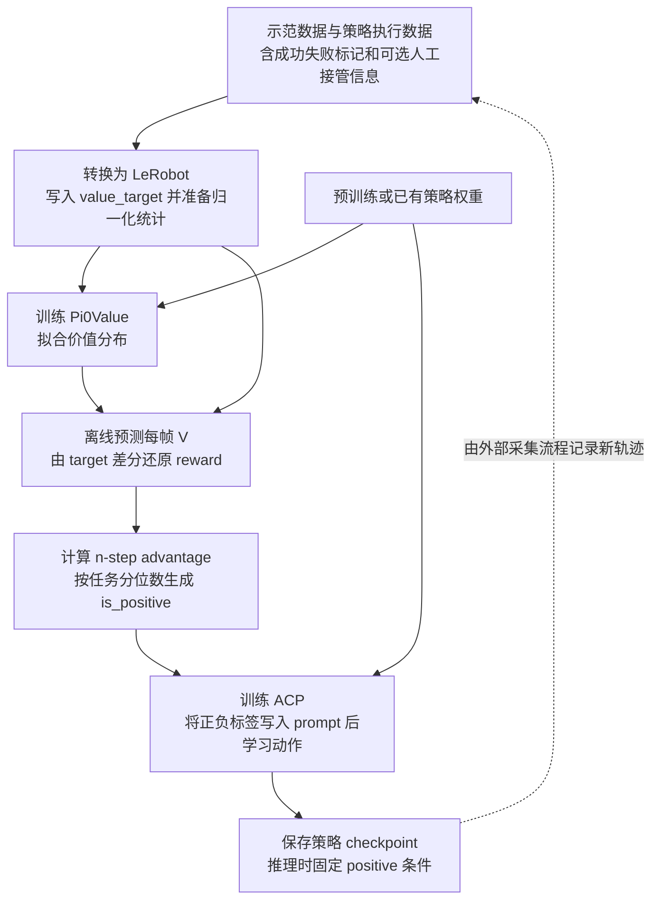

# ReCap 训练全流程说明

本仓库中的 ReCap 训练链路由三个阶段组成：先训练状态价值模型，再离线计算每帧动作的 advantage 并生成条件标签，最后训练 Advantage Conditioned Policy（ACP，优势条件策略）。部署时固定使用 `Advantage: positive` 条件生成动作。理解这条链路的关键，是区分价值监督目标 `value_target`、模型预测 `predicted_value`、动作优势 `advantage` 和策略条件 `is_positive`。

代码基准为 `openpi-umi` 当前 `wbcd` 分支，提交 `07f2e02`，整理日期为 2026 年 10 月 9 日。本地 `recap` 分支指向 `944f093`；下文以当前工作区实现和配置为准。用户所称的 `reacap` 在本文统一记为 ReCap。代码中主要使用 `Value`、`Advantage` 和 `ACP` 命名，没有统一的 `train_recap.py` 入口。

## 1 整体流程



价值模型与动作策略分别训练、分别保存。ACP 阶段读取离线标签，策略损失的梯度不会经过价值模型。当前这些脚本实现了各个训练和标注阶段；真实机器人执行、人工接管采集以及下一轮数据回流，需要由外部流程衔接。

| 阶段 | 输入 | 主要产物 | 实际入口 |
| --- | --- | --- | --- |
| 数据准备 | UMI Zarr、任务、成功失败标记 | LeRobot 数据和 `value_target` | `convert_umi_data_to_lerobot_add_target_value.py` |
| 价值训练 | 观测、任务、`value_target` | Value checkpoint | `train_value.py` 或 `train_value_multi_dataset.py` |
| 离线标注 | Value checkpoint 和 LeRobot 数据 | `predicted_value`、`advantage`、`is_positive` | `lerobot_value_infer.py` |
| ACP 训练 | 带标签的数据、初始策略权重 | ACP policy checkpoint | `train.py` 或 `train_multi_dataset.py` |
| 推理与评估 | ACP checkpoint、实时观测和任务 | 动作块、执行结果 | `serve_policy.py` 和机器人客户端 |

仓库另有 `Pi0Advantage` 与 `train_advantage.py`，支持动作和价值联合训练；下文列出的现成 `pi0_value_*`、`pi05_acp_*` 配置走上述分阶段流程，不应把联合训练脚本当作这些配置的统一入口。

## 2 现有配置与训练入口

以下名称均是当前 [config.py](/data2/hzl_workspace_for_pi/openpi-umi/src/openpi/training/config.py:2863) 中的配置名。

| 用途 | 配置名 | 模型与动作长度 | 训练脚本 |
| --- | --- | --- | --- |
| 头部 RGB 和深度的单数据集 Value | `pi0_value_umi_bimanual_headview_depth` | `Pi0ValueConfig`，horizon 16 | `train_value.py` |
| 头部 RGB 和深度的多数据集 Value | `pi0_value_umi_bimanual_headview_depth_multi_dataset` | `Pi0ValueConfig`，horizon 16 | `train_value_multi_dataset.py` |
| WBCD 四视角 Value | `pi0_value_umi_bimanual_wbcd_multi_dataset` | `Pi0ValueConfig`，配置 horizon 16 | `train_value_multi_dataset.py` |
| 单数据集 ACP | `pi05_acp_umi_bimanual_headview_depth` | `Pi0Config(pi05=True)`，horizon 16 | `train.py` |
| 头部 RGB 和深度的多数据集 ACP | `pi05_acp_umi_bimanual_headview_depth_multi_dataset` | `Pi0GripperConfig`，horizon 16 | `train_multi_dataset.py` |
| WBCD 四视角 ACP | `pi05_acp_umi_bimanual_wbcd_multi_dataset` | `Pi0Config(pi05=True)`，horizon 32 | `train_multi_dataset.py` |

配置中的大量数据、初始权重和资产路径指向原开发机器的 `/root/openpi-umi/...`，需要改成实际路径。动作长度以数据列和所选输入变换为准：Value 模型虽然不计算动作损失，其数据变换仍可能读取、检查 `actions`。

多数据集必须使用对应的多数据集训练脚本。`MultiDataConfigFactory.create_all()` 才会创建所有子数据集；普通单数据集入口调用 `create()` 时，只返回第一个子数据集。配置注释中的 “hybrid” 也不能作为选择训练脚本的依据：这里的 ACP 实例实际使用普通 Pi0 或 Pi0Gripper。[实现位置](/data2/hzl_workspace_for_pi/openpi-umi/src/openpi/training/config.py:2542)

## 3 数据准备与字段约定

### 3.1 每个样本需要什么

| 字段或字段组 | 含义 | 使用阶段 |
| --- | --- | --- |
| RGB 图像及所选配置需要的 depth | 当前视觉观测，模型侧通常为 224 × 224 | Value 和 ACP |
| 双臂位置、6D 旋转、夹爪及相对起始位姿等 | 机器人状态，具体字段由数据配置决定 | Value 和 ACP |
| `task` 和 `task_index` | 任务文本与任务编号 | 文本条件和按任务统计 |
| `actions` | 已打包的未来动作块，双臂真实动作维通常为 20 | ACP；Value 的输入变换也会读取 |
| `episode_index`、`frame_index`、`index` | 轨迹编号、轨迹内零起始帧号、全局样本索引 | 目标构造、时序关系、标注回写 |
| `success` | 轨迹成功失败信息，转换时可以来自逐帧标记 | 生成 `value_target` |
| `value_target` | 归一化回报监督目标 | Value 训练和离线 reward 计算 |
| `action_source` | 可选的动作来源，变换中约定数值 1 为人工动作 | 需要显式保留后才能影响 ACP 条件 |
| `predicted_value`、`advantage`、`is_positive` | 离线标注输出 | 诊断与 ACP 训练 |

头部相机配置需要左右腕 RGB、头部 RGB 和 depth；WBCD 四视角配置需要左右两组 RGB。两者的机器人状态拼接也不同，不能只改配置名后共用输入。头部配置对原始动作有 `(16, 20)` 的显式断言；WBCD 配置读取动作块，但当前没有同样的 horizon 断言。[头部输入变换](/data2/hzl_workspace_for_pi/openpi-umi/src/openpi/policies/umi_policy.py:754) · [WBCD 输入变换](/data2/hzl_workspace_for_pi/openpi-umi/src/openpi/policies/umi_policy.py:1050)

### 3.2 从 Zarr 转换并生成目标

[转换脚本](/data2/hzl_workspace_for_pi/openpi-umi/examples/umi/convert_umi_data_to_lerobot_add_target_value.py:677) 完成状态与动作组织、图像保存、LeRobot 元数据生成，以及可选的 `value_target` 写入。

生成目标的条件是 YAML 在 `load_keys`、`features` 或 `single_frame_features` 中声明 `success`。没有声明时，脚本会跳过目标计算；不能仅凭脚本名认定输出已经含有该列。每帧的 `success` 数组取最后一个元素，一个 episode 内任意有效成功标记为真，就把整条轨迹视为成功。

下面是与第 10 节相对应的头部 RGB 和深度、16 步动作块转换模板。该 YAML 期望原始相机键为 `camera0_rgb`、`camera1_rgb`、`camera_rs_rgb` 和 `camera_rs_depth`，需先与实际 Zarr 字段核对。

```bash
cd /data2/hzl_workspace_for_pi/openpi-umi

uv run examples/umi/convert_umi_data_to_lerobot_add_target_value.py \
  --input /path/to/replay_buffer.zarr \
  --output /path/to/lerobot_dataset \
  --repo-id local/recap_dataset \
  --task "fold the clothes" \
  --fps 20 \
  --state-sequence-length 2 \
  --config examples/umi/config/bimanual_dataset_config_head_view_with_depth_hitl.yaml
```

WBCD 四视角、32 步动作块可改用 [四视角 YAML](/data2/hzl_workspace_for_pi/openpi-umi/examples/umi/config/bimanual_dataset_config_head_view_with_wrist_hitl_horzion_32.yaml:5)，其原始图像键为 `camera0_rgb` 至 `camera3_rgb`；它不能直接用作头部 RGB 和深度配置的数据模板。

YAML 的 `value_target` 段可以设置 `c_fail_coef`、`value_clip_min`、`value_clip_max`，且会覆盖同名含义的 CLI 参数。采样频率、观测历史长度、动作长度要与实际采样数据保持一致。[头部深度 YAML 参数](/data2/hzl_workspace_for_pi/openpi-umi/examples/umi/config/bimanual_dataset_config_head_view_with_depth_hitl.yaml:193)

已有 LeRobot 数据若全部是成功示范，可用下面的脚本补目标。它会原地修改 parquet 和 `meta/info.json`，并把所有 episode 强制视为成功，因此不能用于含失败轨迹的数据。

```bash
uv run scripts/attach_value_targets_success_only.py \
  --dataset-root /path/to/success_only_dataset \
  --c-fail-coef 1.0 --clip-min -1.0 --clip-max 0.0
```

### 3.3 转换时需核对的实现细节

当前转换脚本把 `task_to_task_index` 反转后，又以任务名称查询并默认取 0；多任务转换可能因此把任务编号和目标归一化分组合并到 0。单任务数据通常不显露这个问题，多任务使用前应修正这一映射并核对输出。[映射反转](/data2/hzl_workspace_for_pi/openpi-umi/examples/umi/convert_umi_data_to_lerobot_add_target_value.py:821) · [按名称取编号](/data2/hzl_workspace_for_pi/openpi-umi/examples/umi/convert_umi_data_to_lerobot_add_target_value.py:640)

转换输出的 `episodes.jsonl` 当前没有同步写入 `success`。逐帧已写好的 `value_target` 应继续保留；如果后续改用元数据重算目标，需先补齐轨迹成功失败信息，否则元数据读取逻辑默认将缺失的 `success` 当作成功。[episode 元数据写入](/data2/hzl_workspace_for_pi/openpi-umi/examples/umi/convert_umi_data_to_lerobot_add_target_value.py:523) · [元数据读取](/data2/hzl_workspace_for_pi/openpi-umi/src/openpi/training/value_targets.py:26)

## 4 价值监督目标的计算

设某条轨迹的长度为 `L`，当前帧号为 `t`，同任务最大轨迹长度为 `M`，失败惩罚系数为 `c`，失败轨迹指示量为 `I_fail`。实现中的计算为：

```text
remaining_steps = L - t - 1
c_fail          = M * c
g               = -remaining_steps - c_fail * I_fail
value_target    = clip(g / (M + c_fail), clip_min, clip_max)
```

默认 `c=1`、裁剪区间 `[-1, 0]`。例如 `M=100`、当前轨迹 `L=80`：

| 位置 | 成功轨迹目标 | 失败轨迹目标 |
| --- | --- | --- |
| 第一帧 `t=0` | `-79/200 = -0.395` | `-179/200 = -0.895` |
| 最后一帧 `t=79` | `0` | `-100/200 = -0.5` |

这是一种同时编码剩余步骤和最终成败的价值尺度，数值越大越好，并非直接预测成功概率。即使所有轨迹都成功，`c_fail_coef` 仍影响分母；修改这个系数会改变监督尺度。

转换和补标脚本通常在各自处理的数据集中求每任务最大长度 `M`。多个数据集分别生成目标时，同名任务不保证共用同一个 `M`；混合训练前应确认这些目标尺度符合预期。修改 `TrainConfig.c_fail_coef` 不会重写已经存在的 `value_target`。

公式来源：[compute_normalized_value_targets](/data2/hzl_workspace_for_pi/openpi-umi/src/openpi/training/value_targets.py:89)。

## 5 归一化与模型输入

训练样本的处理顺序为：

```text
LeRobot 样本
  → RepackTransform 保留并重命名所需字段
  → 数据变换，例如 depth 转换、UMI state 和 image 组装
  → Normalize，按 normalize_masks 选择需要归一化的维度
  → 模型变换，例如图像缩放、ACP 标签、任务和状态分词、padding
  → Observation 和 actions
```

Pi0.5 配置通常把状态离散化后编码到文本 token 中，因此 Value 的 prefix 输入也包含状态信息。ACP 标签必须在 tokenizer 之前添加。双臂 20 维动作会补到模型的 32 维，`action_loss_mask=(1.0,)*20+(0.0,)*12` 排除补零维度的动作损失。[数据流水线](/data2/hzl_workspace_for_pi/openpi-umi/src/openpi/training/data_loader.py:173) · [TokenizePrompt](/data2/hzl_workspace_for_pi/openpi-umi/src/openpi/transforms.py:638)

归一化统计通过 `compute_norm_stats.py` 计算 `state` 和 `actions`，也可以显式加载已有且匹配的数据统计。脚本需要已经能通过对应配置的数据变换：例如 Value 配置要求 `value_target`，ACP 配置要求 `is_positive`。

```bash
uv run scripts/compute_norm_stats.py \
  --config-name pi0_value_umi_bimanual_headview_depth
```

多数据集的每个子数据集都要有可用统计。当前 `compute_norm_stats.py` 调用的是 `config.data.create()`，直接传多数据集配置只会处理第一个子数据集；应为各数据集准备相应的单数据集统计配置，或使用已有的匹配统计文件。[统计脚本](/data2/hzl_workspace_for_pi/openpi-umi/scripts/compute_norm_stats.py:102)

统计脚本写入位置是 `config.assets_dirs / data_config.repo_id`；训练加载位置则是配置的 `assets.assets_dir / assets.asset_id`，未显式设置时使用各自默认值。两者必须指向同一份 `norm_stats.json`。当 `repo_id` 是绝对数据集路径时，统计实际写入数据集根目录；常见对应配置是 `assets_dir=数据集根目录`、`asset_id="."`。[统计加载](/data2/hzl_workspace_for_pi/openpi-umi/src/openpi/training/config.py:203)

多数据集训练默认 `use_merged_norm_stats=True`：`create_all()` 会合并各数据集的统计后应用到所有子集，并用 `state_pad_dim=128` 等设置统一状态 shape。采样权重和统计合并权重有不同含义，不能把合并统计理解为严格按所有帧重新计算的总体分位数。[多数据集变换](/data2/hzl_workspace_for_pi/openpi-umi/src/openpi/training/config.py:2574)

## 6 训练价值模型

### 6.1 模型结构与损失

`Pi0Value` 复用 Pi0 的视觉语言骨干。实际价值前向只运行 prefix，不执行动作 suffix：

```text
图像 token + 任务与状态 token
  → PaliGemma prefix hidden states
  → 对有效 token 做 masked mean pooling
  → LayerNorm → Linear → GELU → Dropout → Linear
  → 201 个价值桶的 logits
```

201 个桶均匀覆盖 `[-1, 0]`，相邻间隔为 `0.005`。默认 `soft_value_targets=True`，将连续目标线性分配到相邻两个桶，再以交叉熵训练。例如目标恰好在两个桶中间时，两桶各分配 0.5 概率。关闭该选项时使用最近桶 one-hot。

```text
value_loss = mean_batch(-sum_k target_prob[k] * log_softmax(logits)[k])
V(obs)     = sum_k softmax(logits)[k] * bin_center[k]
```

价值预测是分布的期望，而不是最大概率桶的中心。价值训练阶段不加入动作 flow matching 损失。[Pi0Value 实现](/data2/hzl_workspace_for_pi/openpi-umi/src/openpi/models/pi0_value.py:25)

### 6.2 初始化与参数更新

内置 Value 配置使用 `CheckpointWeightLoaderWithValueHead` 从 π0.5 base 权重初始化骨干；checkpoint 中没有的新价值头保持随机初始化。`get_freeze_filter_value_head_only()` 冻结骨干，仅训练 `final_norm`、`value_fc1`、`value_fc2` 等价值头参数。[权重加载](/data2/hzl_workspace_for_pi/openpi-umi/src/openpi/training/weight_loaders.py:123)

单数据集头部配置的主要参数为：80,000 steps、全局 batch 72、AdamW、梯度范数裁剪 1.0、3,000 步 warmup、峰值学习率 `1e-4`、末端学习率 `1e-5`、EMA 0.999、8 个 FSDP devices、验证比例 0.1。WBCD Value 配置为 60,000 steps，部分学习率和保存间隔也不同，应读取所选实例。[单数据集参数](/data2/hzl_workspace_for_pi/openpi-umi/src/openpi/training/config.py:2912) · [WBCD Value 参数](/data2/hzl_workspace_for_pi/openpi-umi/src/openpi/training/config.py:3080)

训练执行顺序如下：

1. 校验 batch 与设备数量，创建 JAX mesh、checkpoint 管理器和日志。
2. 读取目标相关元数据，创建训练和验证数据加载器。
3. 初始化模型、加载预训练权重、建立可训练参数的优化器状态；若设置 `--resume`，恢复完整训练状态。
4. JIT 编译训练和评估步骤，每批计算价值交叉熵、梯度和参数更新，并更新 EMA。
5. 按间隔记录指标、验证和保存 checkpoint，结束前等待异步保存完成。

入口：[train_value.main](/data2/hzl_workspace_for_pi/openpi-umi/scripts/train_value.py:442)。

### 6.3 目标优先级与验证含义

训练迭代器优先读取 `obs.value_target`，没有该字段才尝试根据 episode、frame 和元数据动态计算。但内置真实数据的 Repack mapping 把 `value_target` 列设为必选，缺列时会更早报错。因此默认流程应预写目标；要使用动态计算，需要同时调整数据 mapping。多数据集动态元数据还可能因重复的 `episode_index` 错配，预写目标能避开这一分支。[目标迭代器](/data2/hzl_workspace_for_pi/openpi-umi/scripts/train_value.py:383)

当前 `val_ratio` 是按 frame 样本随机切分，不是按 episode 切分。同轨迹的相邻帧可能同时进入训练和验证，验证 loss 不代表对全新轨迹的泛化能力。正式评估应另备按轨迹隔离的数据。多数据集 Value 训练在 `val_ratio>0` 时还会关闭加权采样。[多数据集验证划分](/data2/hzl_workspace_for_pi/openpi-umi/scripts/train_value_multi_dataset.py:58)

## 7 离线计算 advantage 并写入标签

### 7.1 价值预测

`lerobot_value_infer.py` 加载选定 Value checkpoint 的 `params`，使用 checkpoint 中的归一化统计，按样本顺序预测每帧价值，然后回写三个字段：

| 输出列 | 类型 | 含义 |
| --- | --- | --- |
| `predicted_value` | float32 | 当前帧价值分布的期望 |
| `advantage` | float32 | 未来 n 步回报加 bootstrap 相对当前价值的差值 |
| `is_positive` | int64，0 或 1 | 当前任务分位数阈值筛选后的条件标签 |

脚本读取数据中已有的 `value_target`，并不会按 CLI 的 `--c-fail-coef` 重新生成目标。因此目标尺度应在训练 Value 之前就确定好。[主标注流程](/data2/hzl_workspace_for_pi/openpi-umi/scripts/lerobot_value_infer.py:516)

### 7.2 从目标还原 reward

设 `y_t=value_target[t]`。在相同 episode 的连续帧之间：

```text
r_t = y_t - y_(t+1)
```

在轨迹末尾或下一帧不连续时：

```text
r_t = y_t
```

默认尺度下，成功轨迹每个非末尾步骤通常贡献一个小的负 reward，末尾 reward 为 0；失败轨迹末尾保留失败惩罚。这个差分定义使连续轨迹末尾之前的累计 reward 能还原对应的目标回报。[reward 计算](/data2/hzl_workspace_for_pi/openpi-umi/scripts/lerobot_value_infer.py:138)

### 7.3 n 步优势

脚本默认 `n_step=50`，实现中没有折扣因子，等价于这里取 `gamma=1`：

```text
A_t = sum(r_t, ..., r_(t+n-1)) + V_(t+n) - V_t
```

实际窗口会截断到当前 episode 内可到达的连续帧数。只有 `t+n` 仍属于同一 episode 且连续时才加入 `V_(t+n)`，到达终点或断帧处则使用 0 作为 bootstrap。n 的单位是帧，应结合数据频率理解；它与策略的 `action_horizon` 是独立参数。[n-step 计算](/data2/hzl_workspace_for_pi/openpi-umi/scripts/lerobot_value_infer.py:161)

例如，未来窗口内累计 reward 为 `-0.05`、后继价值为 `-0.10`、当前价值为 `-0.20`，则 `A=0.05`，表示这段动作的结果好于当前价值预测对应的基线。

### 7.4 每任务分位数标签

给定 `positive_ratio=rho`，脚本为每个任务计算：

```text
threshold[task] = quantile(advantages_of_task, 1 - rho)
is_positive[t]  = int(advantage[t] >= threshold[task_index[t]])
```

当前 `wbcd` 分支默认 `rho=0.3`，本地 `recap` 分支默认 0.4。`positive` 的含义是该任务中相对较好的样本，不等于数学意义上的 `advantage > 0`。使用 `>=` 且存在重复值时，正样本比例可能大于设定比例；当所有 advantage 都相同，甚至会全部标为 positive。

批量处理多个数据集时，每个数据集分别计算任务分位数，同名任务不会跨数据集合并后求阈值。该阈值只用于生成标签，不需要在策略推理时加载。[分位数与二值化](/data2/hzl_workspace_for_pi/openpi-umi/scripts/lerobot_value_infer.py:214)

### 7.5 标注前必须处理的两个限制

**使用匹配的单数据集 Value 配置。** 当前标注脚本只替换配置顶层的 `repo_id` 和 assets。若传入 `*_multi_dataset` 配置，子数据集没有被替换，底层可能仍读取训练配置中的第一个数据集。多数据集训练出的 Value checkpoint 可以用于标注，但需另建匹配其模型、图像、状态变换和归一化资产的单数据集 Value 配置；WBCD 不能直接借用头部深度配置。[配置替换](/data2/hzl_workspace_for_pi/openpi-umi/scripts/lerobot_value_infer.py:771)

**保证总帧数能被实际推理 batch 整除。** 共享加载器设置了 `drop_last=True` 并循环读取，标注脚本却按 `ceil(N / batch)` 次取批。当 `N` 不能整除 batch 时，最后一次可能读到下一轮开头的样本，再把它们的预测写给尾部帧。脚本的 `prediction_seen` 检查不能发现这种错位。当前代码可通过单张可见 GPU、`--batch-size 1` 规避；使用更大 batch 时必须满足整除条件，且有效 batch 还受设备数调整影响。[加载器尾批行为](/data2/hzl_workspace_for_pi/openpi-umi/src/openpi/training/data_loader.py:438) · [预测回填](/data2/hzl_workspace_for_pi/openpi-umi/scripts/lerobot_value_infer.py:572)

主标注脚本沿数据集原始顺序计算时序关系，应确认每条 episode 按连续 `frame_index` 排列。标注会原地改写 parquet 并更新元数据特征；更换 Value checkpoint 或参数后，应重新标注，不能以 `--skip-existing` 判断标签仍然适用。

## 8 ACP 如何使用优势标签

### 8.1 条件进入文本而不是损失权重

`ACPConditionPrompt` 在分词前读取并移除 `is_positive`，将任务文本变成：

```text
fold the clothes
Advantage: positive
```

或：

```text
fold the clothes
Advantage: negative
```

`acp_dropout` 表示不添加标签、保留原任务 prompt 的概率。当前单数据集 ACP 设置为 0.1，多数据集配置为 0.3。它既不丢弃样本，也不将正负标签随机翻转；正样本和负样本都继续学习其数据中的动作。

因此，当前 ACP 是条件动作学习：用文本条件区分相对较好和较差的动作。代码没有用 `advantage` 直接乘动作损失，也没有在该路径实现 PPO ratio clipping、策略梯度更新或在线 critic 更新。[ACPConditionPrompt](/data2/hzl_workspace_for_pi/openpi-umi/src/openpi/transforms.py:160)

### 8.2 人工接管与必需字段

变换内部支持 `action_source==1` 时，在添加标签的分支中强制使用 positive 标签；但现有两个 ACP Repack mapping 都没有保留 `action_source`，所以标准配置下这一覆盖逻辑不会触发。若实验要求人工接管样本在添加标签时强制为 positive，需要显式贯通该字段，并验证到达条件变换时仍存在。该逻辑仍受 `acp_dropout` 影响，人工样本也可能不附加标签。

`is_positive` 是强制字段，缺失时先报错。类中的 `default_positive=True` 不能作为省略标签的兜底，即使设置 `dropout=1` 也仍需该列。WBCD ACP mapping 还要求 `value_target`、`episode_index` 和 `frame_index`，虽然普通策略损失本身不读取这些监督字段。[WBCD ACP mapping](/data2/hzl_workspace_for_pi/openpi-umi/src/openpi/training/config.py:1468) · [头部 ACP mapping](/data2/hzl_workspace_for_pi/openpi-umi/src/openpi/training/config.py:1573)

## 9 ACP 的动作损失和多数据集采样

### 9.1 普通 Pi0.5 的 flow matching

令数据动作块为 `a`，高斯噪声为 `epsilon`，代码采样扩散时间 `tau`，构造：

```text
tau = Beta(1.5, 1) * 0.999 + 0.001
x_tau = tau * epsilon + (1 - tau) * a
u_tau = epsilon - a
```

策略读取图像、状态、含 ACP 标签的任务文本，以及带噪动作和时间，预测速度 `v_theta`。损失是在有效动作维度上的平方误差，再对 batch 和动作时间维平均：

```text
L_flow = mean_batch,time(sum_dim(mask * (v_theta - u_tau)^2) / sum_dim(mask))
```

每样本的 `action_loss_mask` 优先于模型配置中的 mask。单数据集 ACP 和当前 WBCD ACP 都走这个损失。[Pi0.compute_loss](/data2/hzl_workspace_for_pi/openpi-umi/src/openpi/models/pi0.py:193)

### 9.2 带二值夹爪头的配置

头部深度多数据集 ACP 使用 `Pi0GripperConfig`，当前配置额外设置动作索引 `(9, 19)` 为夹爪维，阈值 `0.03`，夹紧标签为 1，打开标签为 0：

```text
gripper_target = int(gripper_value <= 0.03)
L_policy = L_flow + 0.5 * L_gripper_BCE
```

连续 `L_flow` 仍监督包括夹爪在内的前 20 个动作维度，BCE 是额外损失项。推理时二值头会把夹爪维度覆盖为配置中的关闭值 `0.0` 或打开值 `0.085`。这类 checkpoint 的推理模型也必须保留同一个夹爪头。[夹爪模型](/data2/hzl_workspace_for_pi/openpi-umi/src/openpi/models/pi0_gripper.py:278) · [配置](/data2/hzl_workspace_for_pi/openpi-umi/src/openpi/training/config.py:3238)

### 9.3 数据集权重的真实含义

多数据集加载器为数据集 `i` 的每一帧设置权重 `w_i`。若该数据集有 `N_i` 帧，其抽样份额为：

```text
P(dataset_i) = w_i * N_i / sum_j(w_j * N_j)
```

所以全部权重为 1 时，是按帧数占比采样，不是各数据集占比相等。权重不同时使用有放回的 `WeightedRandomSampler`。若希望小数据集与大数据集获得相近份额，需要结合帧数设置权重。[WeightedConcatDataset](/data2/hzl_workspace_for_pi/openpi-umi/src/openpi/training/multi_data_loader.py:23)

ACP 多数据集使用普通 `train_multi_dataset.py` 即可，它复用 `train.py` 的初始化和 `compute_loss` 训练步骤。不要直接套用 `train_multi_dataset_hybrid.py` 的默认参数：后者默认存在 FAST 离散头 warmup，而上述 ACP 模型并没有对应离散训练头。

当前三个 ACP 配置的训练参数如下；它们均使用 AdamW、梯度范数裁剪 1.0、峰值学习率 `8e-5` 和 EMA 0.999。

| ACP 配置 | 训练步数 | 全局 batch | FSDP devices | Warmup 步数 | 初始化来源 |
| --- | --- | --- | --- | --- | --- |
| 头部深度单数据集 | 50,000 | 72 | 2 | 1,000 | π0.5 base |
| 头部深度多数据集 | 80,000 | 72 | 8 | 2,000 | π0.5 base，新增夹爪头随机初始化 |
| WBCD 四视角多数据集 | 30,000 | 72 | 8 | 2,000 | 配置指定的已有 WBCD 策略 checkpoint |

## 10 按顺序执行训练

下面给出头部 RGB 和深度、16 步动作块的单数据集流程。命令均在仓库根目录执行，是需要替换数据路径和 checkpoint 路径的模板；数据应已经按第 3 节准备完成。先调整配置的 `repo_id`、`assets`、初始权重路径，以及匹配实际设备的 `batch_size`、`fsdp_devices`。

### 10.1 准备环境和价值统计

仓库使用 `uv` 管理依赖；这条 Value 和 ACP 实现使用 JAX、Flax、Optax 与 Orbax。按照仓库依赖配置准备环境后执行：

```bash
GIT_LFS_SKIP_SMUDGE=1 uv sync
GIT_LFS_SKIP_SMUDGE=1 uv pip install -e .

uv run scripts/compute_norm_stats.py \
  --config-name pi0_value_umi_bimanual_headview_depth
```

### 10.2 训练 Value

```bash
XLA_PYTHON_CLIENT_MEM_FRACTION=0.9 \
uv run scripts/train_value.py \
  pi0_value_umi_bimanual_headview_depth \
  --exp-name recap_value_v1
```

选择实际生成且通过评估的 step checkpoint。`--checkpoint-dir` 需要指向包含 `params/` 和 `assets/` 的 step 目录；权重加载器配置中的路径则通常直接指向 `params/`，两者层级不同。

### 10.3 标注策略训练数据

以下使用单张可见 GPU 和 batch 1，避开第 7 节的尾批问题：

```bash
CUDA_VISIBLE_DEVICES=0 \
uv run scripts/lerobot_value_infer.py \
  --config-name pi0_value_umi_bimanual_headview_depth \
  --checkpoint-dir /path/to/value_checkpoint_step \
  --dataset-root /path/to/policy_training_dataset \
  --batch-size 1 \
  --n-step 50 \
  --positive-ratio 0.3
```

`--dataset-root` 也支持父目录，按直接子目录发现数据集；`--include`、`--exclude` 可筛选目录名称，`--list-only` 可先查看待处理列表。各子集应使用匹配同一个 Value 输入配置的 schema。`--skip-existing` 只检查元数据是否声明三列，不验证标签来自哪个 checkpoint。

### 10.4 检查标注质量

```bash
uv run scripts/evaluate_value_model.py \
  --dataset-root /path/to/policy_training_dataset \
  --output-dir /path/to/value_eval \
  --plot-episodes 5
```

检查预测与目标的误差、轨迹内价值曲线、成功失败轨迹分布、advantage 分布及正样本比例。确认没有尾部预测错位、跨轨迹计算窗口或全部标签意外相同，再进入策略训练。

评估脚本的成功失败分组还需核对标签语义：它直接按每帧 `success` 分组，并把每条轨迹的首帧标记作为该轨迹标签；目标生成则使用整条轨迹的 `any(success)`。如果只在成功末帧置真，该脚本的成功失败分组不能直接解释为整条轨迹的成败，需先统一评估标签定义。[评估标签读取](/data2/hzl_workspace_for_pi/openpi-umi/scripts/evaluate_value_model.py:147)

### 10.5 训练 ACP

将 ACP 配置的 `repo_id` 指向刚完成标注的数据集，并准备该配置对应的归一化统计，然后执行：

```bash
uv run scripts/compute_norm_stats.py \
  --config-name pi05_acp_umi_bimanual_headview_depth

XLA_PYTHON_CLIENT_MEM_FRACTION=0.9 \
uv run scripts/train.py \
  pi05_acp_umi_bimanual_headview_depth \
  --exp-name recap_acp_v1
```

### 10.6 切换为多数据集

以 WBCD 为例，训练入口改为：

```bash
uv run scripts/train_value_multi_dataset.py \
  pi0_value_umi_bimanual_wbcd_multi_dataset \
  --exp-name recap_value_wbcd_v1

# 完成全部策略数据的离线标注后，再执行策略训练。
uv run scripts/train_multi_dataset.py \
  pi05_acp_umi_bimanual_wbcd_multi_dataset \
  --exp-name recap_acp_wbcd_v1
```

这里仍然要单独完成“每个数据集的目标与统计 → Value 训练 → 每个策略数据集的标注 → ACP 训练”。WBCD 的离线标注需要新建匹配的单数据集 Value 配置，不能直接把上述多数据集配置名传给标注脚本，也不能替换成头部深度 Value 配置。

## 11 Checkpoint 和训练监控

默认保存目录为：

```text
checkpoints/<config_name>/<exp_name>/<step>/
  params/       推理权重，启用 EMA 时导出 EMA 参数
  train_state/  训练状态，包含恢复训练所需的优化器等信息
  assets/       归一化统计，按 asset_id 存放
```

保存频率由 `save_interval` 控制；管理器保留最近 checkpoint 以及满足 `keep_period` 的历史点。最终 step 目录名应以实际产物为准，脚本循环使用零起始步号。`--resume` 恢复同一实验，`--overwrite` 会删除该实验已有 checkpoint 目录。[保存与恢复](/data2/hzl_workspace_for_pi/openpi-umi/src/openpi/training/checkpoints.py:20)

Value 日志包含训练 loss、梯度范数和预测与目标均值；验证优先使用 EMA 参数。`best_val_loss` 仅用于记录和打印，当前没有按最佳验证分数额外保存模型。普通 ACP 训练记录总 loss、梯度范数和参数范数；Pi0Gripper 的总 loss 已包含 BCE，但普通训练入口不会单独拆出夹爪 BCE 日志。

多数据集当前多使用 `asset_id="."`，保存时会写向同一资产位置。启用默认的合并统计时，各子集使用相同统计；若关闭合并并希望分别保留不同统计，应给各数据集不同的 asset ID，并在推理时选对统计。[assets 保存](/data2/hzl_workspace_for_pi/openpi-umi/src/openpi/training/checkpoints.py:65)

## 12 正条件策略推理

推理时使用 `ACPForcePositivePrompt`，在任务文本后固定添加 `Advantage: positive`，再由策略从高斯噪声开始迭代生成动作块。普通 Pi0 的 `sample_actions` 默认执行 10 个积分步骤，从扩散时间 1 走到 0，随后反归一化输出动作块。[正条件变换](/data2/hzl_workspace_for_pi/openpi-umi/src/openpi/transforms.py:221) · [动作采样](/data2/hzl_workspace_for_pi/openpi-umi/src/openpi/models/pi0.py:243)

当前 `UmiOutputsV4` 原样返回输出，不会自动把模型的 32 维动作裁为有效的 20 维，也不会完成相对动作到机器人执行指令的转换。机器人客户端需要按训练动作定义完成这些处理，再执行动作。[输出变换](/data2/hzl_workspace_for_pi/openpi-umi/src/openpi/policies/umi_policy.py:1443)

Value 模型不需要参与每次动作推理；它用于前面的离线标注。策略推理也不需要在线计算 `is_positive` 或再次求分位数。

### 12.1 对齐训练和推理配置

现有 `_infer` 预设应先核对，不能按名称直接认为与训练配置匹配：

| 项目 | 当前情况 | 部署时的处理 |
| --- | --- | --- |
| WBCD 动作长度 | ACP 训练 horizon 32，现有 WBCD infer 为 16 | 使用与训练一致的 32 |
| 夹爪模型 | 头部多数据集训练为 Pi0Gripper，现有头部 infer 为普通 Pi0 | 保留训练时相同的模型类型和夹爪参数 |
| 状态 padding | 多数据集训练额外应用 `state_pad_dim` | 保留训练时相同状态处理 |
| 归一化 | 部署需要训练时的统计 | 优先使用 checkpoint 的 `assets` |
| 机器人文本条件 | 训练 loader 会设置 `robot_type`，policy 工厂未自动做同样处理 | 同步 tokenizer 的机器人条件 |
| 输入字段 | policy 工厂默认不应用数据配置的 Repack mapping | 客户端直接传变换需要的字段，或显式提供 repack |

稳妥的配置方式是保留训练时的 `model` 和数据变换，将模型变换中的 `ACPConditionPrompt` 替换为 `ACPForcePositivePrompt`，同时保留归一化 mask、状态 padding、机器人条件和输出变换。对于多数据集，部署需选择目标机器人的输入 schema。相关入口为 [create_trained_policy](/data2/hzl_workspace_for_pi/openpi-umi/src/openpi/policies/policy_config.py:16) 和 [现有推理预设](/data2/hzl_workspace_for_pi/openpi-umi/src/openpi/training/config.py:3485)。

输入通常使用 `prompt` 表达任务；当前 UMI 输入变换还直接读取 `actions`，客户端需提供相应 shape 的占位数组，头部深度配置要求 `(16, 20)`。它是满足预处理接口的占位输入，生成动作仍由模型采样得到。相机键、图像布局、状态历史和相对位姿也必须满足所选输入变换。

### 12.2 启动服务

完成上述配置对齐并在配置表注册推理配置后，可使用：

```bash
uv run scripts/serve_policy.py \
  policy:checkpoint \
  --policy.config=your_aligned_acp_inference_config \
  --policy.dir=/path/to/acp_checkpoint_step
```

`your_aligned_acp_inference_config` 是需自行注册的配置占位名。真实机器人客户端负责提供观测、执行动作块，并记录成功失败及人工接管信息。

## 13 评估与下一轮训练

离线评估重点是“Value 是否能提供有用的动作排序”和“ACP 条件是否改善实际动作”，两者需要分别检查。

| 工具或评估方式 | 可以回答的问题 |
| --- | --- |
| `evaluate_value_model.py` | 已写入预测的误差、相关性、轨迹曲线和 advantage 分布是否合理 |
| `evaluate_value_pairwise_ranking.py` | 同一 episode 内不同帧对的价值排序是否符合目标关系 |
| `evaluate_value_bucket_confusion.py` | 价值桶预测的混淆和分布情况 |
| `visualize_advantage_video.py` | 动作、视觉变化、advantage 和接管片段是否一致 |
| 真实任务执行 | 成功率、完成时间、接管频率及动作质量是否改善 |

涉及重新推理的评估工具也要核对其数据配置、batch 和目标来源，不能仅凭脚本名认为沿用了与训练完全一致的数据路径。真实任务指标需要实际采集；训练 loss 的降低不能替代执行评估。

下一轮可将新策略执行轨迹、失败轨迹和人工纠正数据加入数据池，再生成目标、更新或重新选择 Value 模型、重新标注、训练下一版 ACP。每轮应保留数据版本、目标生成参数、Value checkpoint、`n_step`、`positive_ratio`、ACP 配置和策略 checkpoint 的对应关系，保证标签与模型能够追溯。

## 14 关键代码导航

| 要理解的问题 | 代码入口 |
| --- | --- |
| Value target 如何计算 | [value_targets.py](/data2/hzl_workspace_for_pi/openpi-umi/src/openpi/training/value_targets.py:89) |
| Value 结构和分布交叉熵 | [pi0_value.py](/data2/hzl_workspace_for_pi/openpi-umi/src/openpi/models/pi0_value.py:25) |
| Value 单数据集训练循环 | [train_value.py](/data2/hzl_workspace_for_pi/openpi-umi/scripts/train_value.py:442) |
| Value 多数据集划分和训练 | [train_value_multi_dataset.py](/data2/hzl_workspace_for_pi/openpi-umi/scripts/train_value_multi_dataset.py:58) |
| Reward 和 advantage | [lerobot_value_infer.py](/data2/hzl_workspace_for_pi/openpi-umi/scripts/lerobot_value_infer.py:138) |
| ACP 文本条件 | [transforms.py](/data2/hzl_workspace_for_pi/openpi-umi/src/openpi/transforms.py:141) |
| ACP 配置与超参数 | [config.py](/data2/hzl_workspace_for_pi/openpi-umi/src/openpi/training/config.py:3191) |
| 普通策略训练步骤 | [train.py](/data2/hzl_workspace_for_pi/openpi-umi/scripts/train.py:221) |
| 多数据集策略入口 | [train_multi_dataset.py](/data2/hzl_workspace_for_pi/openpi-umi/scripts/train_multi_dataset.py:55) |
| 动作 flow matching | [pi0.py](/data2/hzl_workspace_for_pi/openpi-umi/src/openpi/models/pi0.py:193) |
| 推理组装与归一化恢复 | [policy_config.py](/data2/hzl_workspace_for_pi/openpi-umi/src/openpi/policies/policy_config.py:16) |
| Checkpoint 内容 | [checkpoints.py](/data2/hzl_workspace_for_pi/openpi-umi/src/openpi/training/checkpoints.py:65) |
